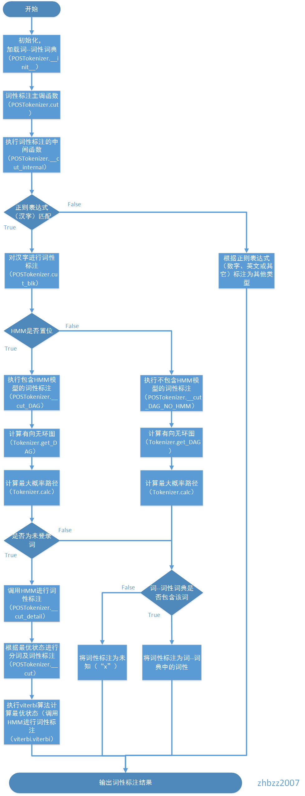
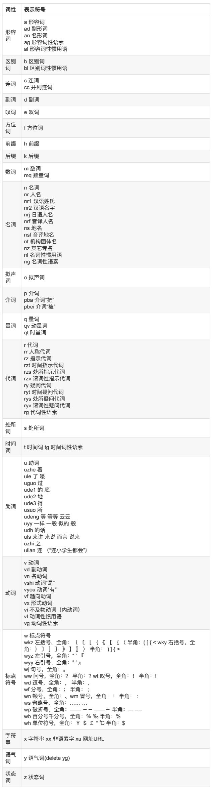

以nlp中情感分析为例，从没有打过标签的语料开始一步步教你怎么去打标签，然后分别以传统的机器学习模型SVM和深度学习模型LSTM去建模。

# 1 词性标注

词性（part-of-speech）是词汇基本的语法范畴，通常也称为词类，主要用来描述一个词在上下文的作用。
例如，描述一个概念的词就是名词，在下文引用这个名词的词就是代词。
有的词性经常会出现一些新的词，例如名词，这样的词性叫做开放式词性。
另外一些词性中的词比较固定，例如代词，这样的词性叫做封闭式词性。
因为存在一个词对应多个词性的现象，所以给词准确地标注词性并不是很容易。
例如，“改革”在“中国开始对计划经济体制进行改革”这句话中是一个动词，但是在“医药卫生改革中的经济问题”这个句子中是一个名词。
把这个问题抽象出来，就是已知单词序列，给每个单词标注词性。
词性标注是自然语言处理中一项非常重要的基础性工作。

汉语词性标注同样面临许多棘手的问题，其主要的难点可以归纳为以下三个方面：

* （1） 汉语是一种缺乏词形态变化的语言，词的类别不能像印欧语言那样，直接从词的形态变化来判别；
* （2） 常用词兼类现象严重，越是常用的词，不同的用法越多，尽管兼类现象仅仅占汉语词汇很小的一部分，但是由于兼类使用的程度高，兼类现象纷繁，覆盖面广，涉及汉语中大部分词类，因而造成汉语文本中词类歧义排除的任务量大，而且面广，复杂多样；
* （3） 研究者主观原因造成的困难。语言学界在词性划分的目的、标准等问题还存在分歧；

不同的语言有不同的词性标注集。为了方便指明词的词性，可以给每个词性编码，可以具体参考[ICTCLAS 汉语词性标注集](https://fhqllt.iteye.com/blog/947917) ，
其中，常见的有a表示形容词，d表示副词，n表示名词，p表示介词，v表示动词。

目前采用的词性标注方法主要**有基于统计模型的标注方法、基于规则的标注方法、统计方法与规则方法相结合的方法、基于有限状态转换机的标注方法和基于神经网络的词性标注方法。**

jieba分词中提供了词性标注功能，可以标注标注句子分词后每个词的词性，词性标注集采用北大计算所词性标注集，属于采用基于统计模型的标注方法，下面将通过实例讲解介绍如何使用jieba分词的词性标注接口、以及通过源码讲解其实现的原理。
ICTCLAS现在已经更新为NLPIR，github地址为 https://github.com/NLPIR-team/NLPIR

```python
# 引入词性标注接口
import jieba.posseg as psg

text = "去北京大学玩"
#词性标注
seg = psg.cut(text)

#将词性标注结果打印出来
for ele in seg:
    print(ele)
```

```text
去/v
北京大学/nt
玩/v
```

jieba分词的词性标注过程非常类似于jieba分词的分词流程，同时进行分词和词性标注。
在词性标注的时候，首先基于正则表达式（汉字）进行判断，
1）如果是汉字，则会基于前缀词典构建有向无环图，
然后基于有向图计算最大概率路径，同时在前缀词典中查找所分出的词的词性，
如果没有找到，则将其词性标注为“x”（非语素字 非语素字只是一个符号，字母x通常用于代表未知数、符号）；
如果HMM标志位置位，并且该词为未登录词，则通过隐马尔科夫模型对其进行词性标注；
2）如果是其它，则根据正则表达式判断其类型，分别赋予“x”，“m”（数词 取英语numeral的第3个字母，n，u已有他用），“eng”（英文）。

流程图如下所示

https://blog.csdn.net/lk7688535/article/details/77971376

jieba词性表




# 2 分词

# 3 词向量

# 4 模型训练

# 5 模型评估与预测

## SVM
```text
/Users/zhaoyadong/anaconda3/envs/nlp/bin/python /Users/zhaoyadong/opt/git/nlp/03-sentiment_analysis/sentiment_analysis_from_raw_corpus/05_sentiment_analysis_ml.py
/Users/zhaoyadong/anaconda3/envs/nlp/lib/python3.6/site-packages/sklearn/externals/joblib/__init__.py:15: DeprecationWarning: sklearn.externals.joblib is deprecated in 0.21 and will be removed in 0.23. Please import this functionality directly from joblib, which can be installed with: pip install joblib. If this warning is raised when loading pickled models, you may need to re-serialize those models with scikit-learn 0.21+.
  warnings.warn(msg, category=DeprecationWarning)
#------------------------------------------------------#
加载数据集
Building prefix dict from the default dictionary ...
Dumping model to file cache /var/folders/4l/r6793fn53yn8_f0mcm25gddr0000gn/T/jieba.cache
Loading model cost 0.721 seconds.
Prefix dict has been built succesfully.
positive data:49650
neutral data:1527
negative data:11823
#------------------------------------------------------#


#------------------------------------------------------#
保存标签数据
训练集总数：50400
训练集正样本：39720
训练集中性样本：1241
训练集负样本：9439
测试集总数：12600
测试集正样本：9930
测试集中性样本：286
测试集负样本：2384
#------------------------------------------------------#


训练集数据的词向量维度：(50400, 300)
测试集数据的词向量维度：(12600, 300)
/Users/zhaoyadong/anaconda3/envs/nlp/lib/python3.6/site-packages/sklearn/utils/validation.py:724: DataConversionWarning: A column-vector y was passed when a 1d array was expected. Please change the shape of y to (n_samples, ), for example using ravel().
  y = column_or_1d(y, warn=True)
/Users/zhaoyadong/anaconda3/envs/nlp/lib/python3.6/site-packages/sklearn/svm/base.py:193: FutureWarning: The default value of gamma will change from 'auto' to 'scale' in version 0.22 to account better for unscaled features. Set gamma explicitly to 'auto' or 'scale' to avoid this warning.
  "avoid this warning.", FutureWarning)
..
Warning: using -h 0 may be faster
*.......
Warning: using -h 0 may be faster
*
optimization finished, #iter = 9657
obj = -2477.248392, rho = -0.733248
nSV = 2970, nBSV = 2121
..........
Warning: using -h 0 may be faster
*..
Warning: using -h 0 may be faster
*
optimization finished, #iter = 12237
obj = -18837.129207, rho = 0.564807
nSV = 18998, nBSV = 18763
..
Warning: using -h 0 may be faster
*.
Warning: using -h 0 may be faster
*
optimization finished, #iter = 3376
obj = -2466.193869, rho = -0.878796
nSV = 2603, nBSV = 2359
Total nSV = 20970
[LibSVM]#----------------------------------------#
SVM测试集测试得分：0.7880952380952381
#----------------------------------------#
```


## LSTM
```text
/Users/zhaoyadong/anaconda3/envs/nlp/bin/python /Users/zhaoyadong/opt/git/nlp/03-sentiment_analysis/sentiment_analysis_from_raw_corpus/05_sentiment_analysis_dl.py
/Users/zhaoyadong/opt/git/nlp/03-sentiment_analysis/sentiment_analysis_from_raw_corpus/05_sentiment_analysis_dl.py:41: ParserWarning: Falling back to the 'python' engine because the 'c' engine does not support sep=None with delim_whitespace=False; you can avoid this warning by specifying engine='python'.
  neg=pd.read_csv('./data/neg.csv',header=None,index_col=None,encoding='utf-8',sep=None, error_bad_lines=False)
Loading Data...
Skipping line 1264: '	' expected after '"'
Skipping line 4066: Expected 2 fields in line 4066, saw 3
Skipping line 6797: Expected 2 fields in line 6797, saw 3
/Users/zhaoyadong/opt/git/nlp/03-sentiment_analysis/sentiment_analysis_from_raw_corpus/05_sentiment_analysis_dl.py:42: ParserWarning: Falling back to the 'python' engine because the 'c' engine does not support sep=None with delim_whitespace=False; you can avoid this warning by specifying engine='python'.
  pos=pd.read_csv('./data/pos.csv',header=None,index_col=None,encoding='utf-8',sep=None, error_bad_lines=False)
Skipping line 4897: Expected 2 fields in line 4897, saw 15
Skipping line 8214: Expected 2 fields in line 8214, saw 16
Skipping line 9851: Expected 2 fields in line 9851, saw 3
Skipping line 11076: Expected 2 fields in line 11076, saw 5
Skipping line 11961: Expected 2 fields in line 11961, saw 10
Skipping line 12989: Expected 2 fields in line 12989, saw 21
Skipping line 13449: Expected 2 fields in line 13449, saw 4
Skipping line 16555: Expected 2 fields in line 16555, saw 5
Skipping line 18209: Expected 2 fields in line 18209, saw 3
Skipping line 18612: Expected 2 fields in line 18612, saw 11
Skipping line 19236: Expected 2 fields in line 19236, saw 3
Skipping line 19753: Expected 2 fields in line 19753, saw 11
Skipping line 23356: Expected 2 fields in line 23356, saw 3
Skipping line 30227: Expected 2 fields in line 30227, saw 14
Skipping line 35269: Expected 2 fields in line 35269, saw 5
Skipping line 38929: Expected 2 fields in line 38929, saw 8
/Users/zhaoyadong/opt/git/nlp/03-sentiment_analysis/sentiment_analysis_from_raw_corpus/05_sentiment_analysis_dl.py:43: ParserWarning: Falling back to the 'python' engine because the 'c' engine does not support sep=None with delim_whitespace=False; you can avoid this warning by specifying engine='python'.
  neu=pd.read_csv('./data/neutral.csv', header=None, index_col=None,encoding='utf-8',sep=None, error_bad_lines=False)
Skipping line 611: Expected 2 fields in line 611, saw 12
62980 62980
Tokenising...
Building prefix dict from the default dictionary ...
WARNING: Logging before flag parsing goes to stderr.
I0529 20:16:11.779493 4609361344 __init__.py:111] Building prefix dict from the default dictionary ...
Dumping model to file cache /var/folders/4l/r6793fn53yn8_f0mcm25gddr0000gn/T/jieba.cache
I0529 20:16:12.541044 4609361344 __init__.py:145] Dumping model to file cache /var/folders/4l/r6793fn53yn8_f0mcm25gddr0000gn/T/jieba.cache
Loading model cost 0.821 seconds.
I0529 20:16:12.600433 4609361344 __init__.py:163] Loading model cost 0.821 seconds.
Prefix dict has been built succesfully.
I0529 20:16:12.600592 4609361344 __init__.py:164] Prefix dict has been built succesfully.
Training a Word2vec model...
W0529 20:16:55.765701 4609361344 smart_open_lib.py:385] this function is deprecated, use smart_open.open instead
Setting up Arrays for Keras Embedding Layer...
(50384, 100) (50384, 3)
x_train.shape and y_train.shape:
(50384, 100) (50384, 3)
Defining a Simple Keras Model...
2019-05-29 20:16:58.073003: I tensorflow/core/platform/cpu_feature_guard.cc:142] Your CPU supports instructions that this TensorFlow binary was not compiled to use: AVX2 FMA
Compiling the Model...
Train...
Epoch 1/4
50384/50384 [==============================] - 193s 4ms/sample - loss: 0.7669 - accuracy: 0.7871
Epoch 2/4
50384/50384 [==============================] - 195s 4ms/sample - loss: 0.7637 - accuracy: 0.7878
Epoch 3/4
50384/50384 [==============================] - 193s 4ms/sample - loss: 0.7637 - accuracy: 0.7878
Epoch 4/4
50384/50384 [==============================] - 190s 4ms/sample - loss: 0.7638 - accuracy: 0.7878
Evaluate...
12596/12596 [==============================] - 7s 535us/sample - loss: 0.7620 - accuracy: 0.7895
Test score: [0.7619567367151526, 0.78945696]
loading model......
/Users/zhaoyadong/opt/git/nlp/03-sentiment_analysis/sentiment_analysis_from_raw_corpus/05_sentiment_analysis_dl.py:168: YAMLLoadWarning: calling yaml.load() without Loader=... is deprecated, as the default Loader is unsafe. Please read https://msg.pyyaml.org/load for full details.
  yaml_string = yaml.load(f)
/Users/zhaoyadong/anaconda3/envs/nlp/lib/python3.6/site-packages/tensorflow/python/keras/saving/model_config.py:76: YAMLLoadWarning: calling yaml.load() without Loader=... is deprecated, as the default Loader is unsafe. Please read https://msg.pyyaml.org/load for full details.
  config = yaml.load(yaml_string)
2019-05-29 20:35:50.387749: I tensorflow/core/platform/cpu_feature_guard.cc:142] Your CPU supports instructions that this TensorFlow binary was not compiled to use: AVX2 FMA
loading weights......
Building prefix dict from the default dictionary ...
WARNING: Logging before flag parsing goes to stderr.
I0529 20:35:50.698750 4596483520 __init__.py:111] Building prefix dict from the default dictionary ...
Loading model from cache /var/folders/4l/r6793fn53yn8_f0mcm25gddr0000gn/T/jieba.cache
I0529 20:35:50.699036 4596483520 __init__.py:131] Loading model from cache /var/folders/4l/r6793fn53yn8_f0mcm25gddr0000gn/T/jieba.cache
Loading model cost 0.593 seconds.
I0529 20:35:51.291879 4596483520 __init__.py:163] Loading model cost 0.593 seconds.
Prefix dict has been built succesfully.
I0529 20:35:51.292006 4596483520 __init__.py:164] Prefix dict has been built succesfully.
W0529 20:35:51.292563 4596483520 smart_open_lib.py:385] this function is deprecated, use smart_open.open instead
loading model......
/Users/zhaoyadong/opt/git/nlp/03-sentiment_analysis/sentiment_analysis_from_raw_corpus/05_sentiment_analysis_dl.py:168: YAMLLoadWarning: calling yaml.load() without Loader=... is deprecated, as the default Loader is unsafe. Please read https://msg.pyyaml.org/load for full details.
  yaml_string = yaml.load(f)
/Users/zhaoyadong/anaconda3/envs/nlp/lib/python3.6/site-packages/tensorflow/python/keras/saving/model_config.py:76: YAMLLoadWarning: calling yaml.load() without Loader=... is deprecated, as the default Loader is unsafe. Please read https://msg.pyyaml.org/load for full details.
  config = yaml.load(yaml_string)
loading weights......
W0529 20:35:52.156678 4596483520 smart_open_lib.py:385] this function is deprecated, use smart_open.open instead
/Users/zhaoyadong/opt/git/nlp/03-sentiment_analysis/sentiment_analysis_from_raw_corpus/05_sentiment_analysis_dl.py:168: YAMLLoadWarning: calling yaml.load() without Loader=... is deprecated, as the default Loader is unsafe. Please read https://msg.pyyaml.org/load for full details.
  yaml_string = yaml.load(f)
loading model......
/Users/zhaoyadong/anaconda3/envs/nlp/lib/python3.6/site-packages/tensorflow/python/keras/saving/model_config.py:76: YAMLLoadWarning: calling yaml.load() without Loader=... is deprecated, as the default Loader is unsafe. Please read https://msg.pyyaml.org/load for full details.
  config = yaml.load(yaml_string)
loading weights......
W0529 20:35:53.006731 4596483520 smart_open_lib.py:385] this function is deprecated, use smart_open.open instead

Process finished with exit code 0
```
